# AWS – Realtime Threat Detection And Prevention

This project (AWS-Real Time Threat Detection and Prevention) is based on implementation of a comprehensive threat monitoring and detection system. In today’s digital landscape, organizations face an ever-increasing number of sophisticated cyber threats. To combat these threats, businesses must implement robust security measures to safeguard their critical assets and data. One such approach is the implementation of a comprehensive threat monitoring and
detection system. This project describes how AWS services can be leveraged to build an effective threat monitoring and detection system in Real Time for enhanced security.

GuardDuty is an AWS managed Threat detection service and customers speak a lot about securing their AWS infrastructure and its automated remediation. GuardDuty uses a combination of AWS CloudTrail, Amazon VPC Flow Logs and DNS Logs to detect malicious behaviour and generate alerts if a possible compromise has been detected. A GuardDuty finding represents a potential security issue detected within the network. GuardDuty generates a finding whenever it detects unexpected and potentially malicious activity in your AWS environment. So using GuardDuty, we will deliberately create findings and can see all those events
in the GuardDuty console followed by remediation using AWS CloudWatch events and Lambda functions.

- PREREQUISITES:
        
    1) GuardDuty
    2) EC2
    3) CloudWatch
    4) IAM
    5) AWS Lambda

## Demo

- Created EC2 instance as web server, database server, and compromised machine to demonstrate an attack scenario in network:
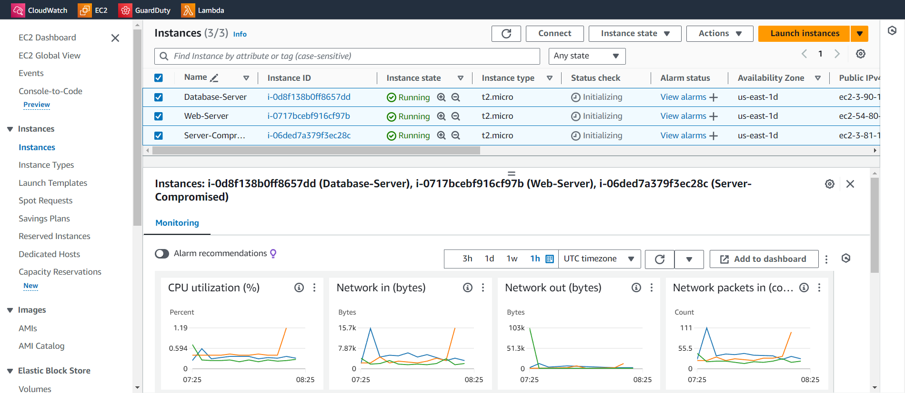

- Security group of compromised machine:
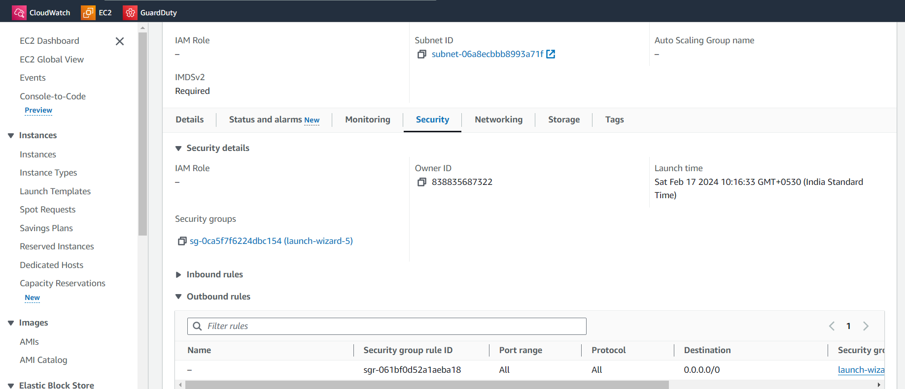

- created an isolated security group to isolate a compromised machine:
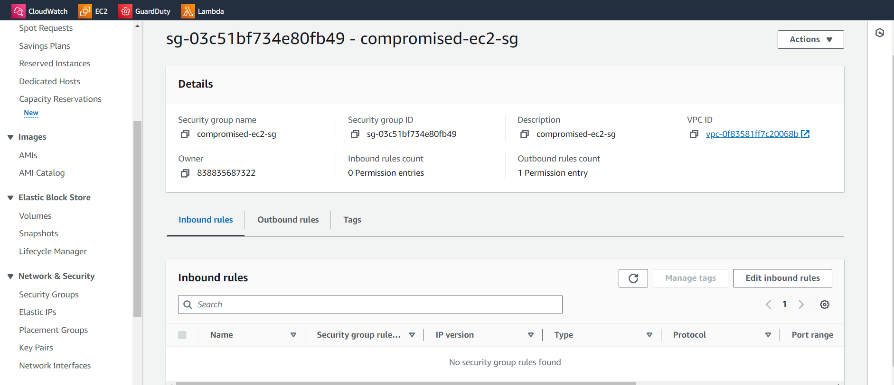

- Created CloudWatch rules for SNS and AWS Lambda function:
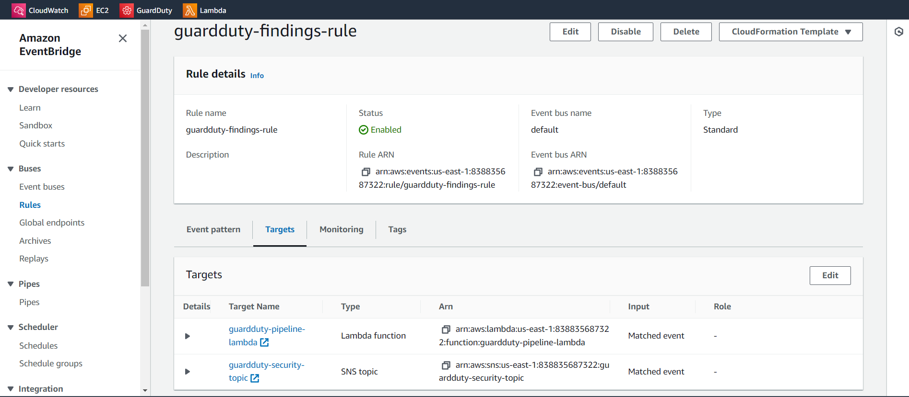

- Configured SNS for desired endpoint mail ID:
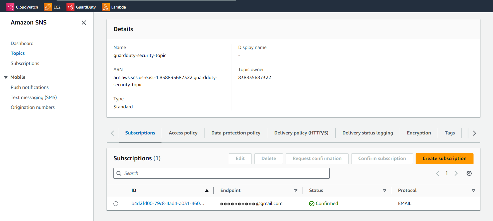

- Configured GuardDuty to scan malicious activities:
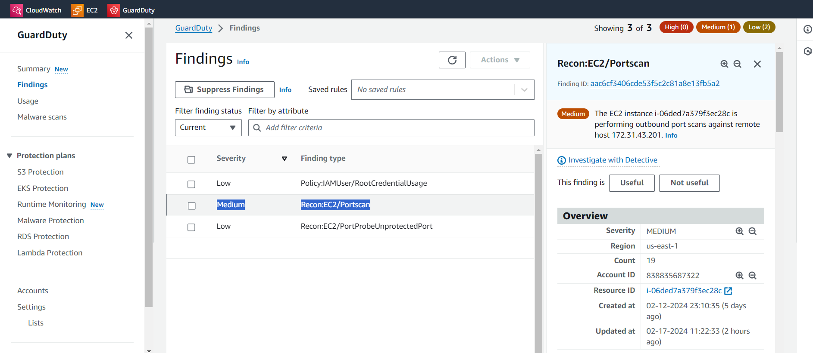

- Lambda function code to isolate an compromised instance by changing security group:
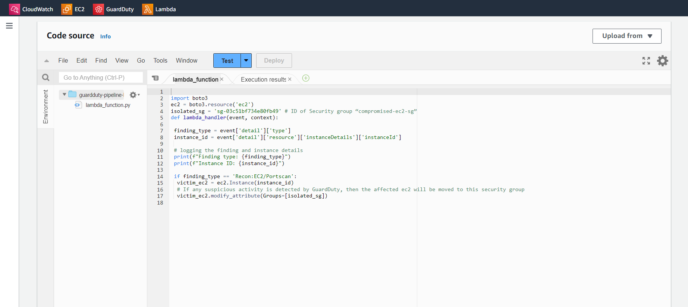

- Performing nmap to demonstrate portscan attack:
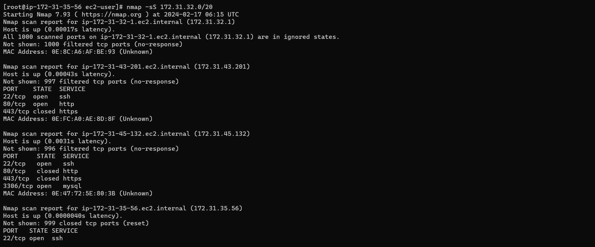

- CloudWatch logs after Attack is detected:
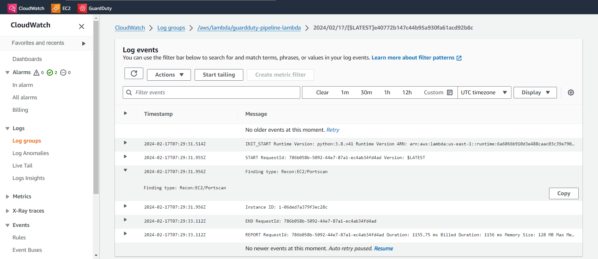

- SNS mail alert with JSON file:
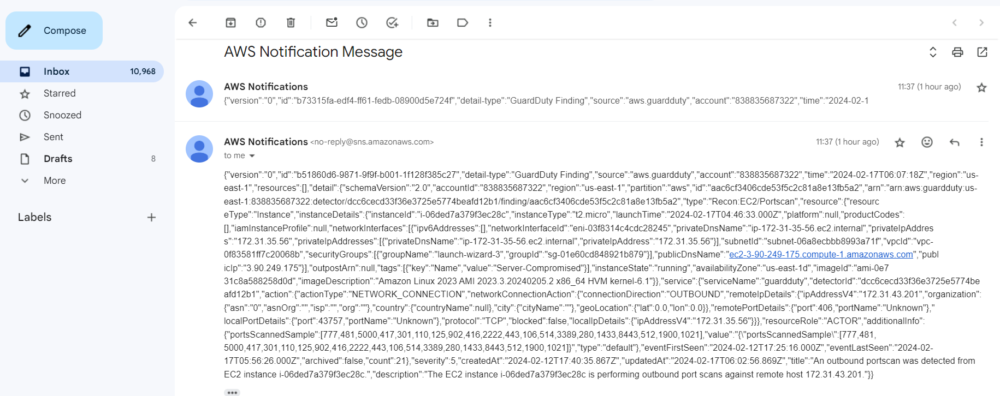

- After Attack is detected the security group of Compromised instance from attacker is performing portscan is changed to isolated group:

- The SSH connection gets automatically disconnected in real time:
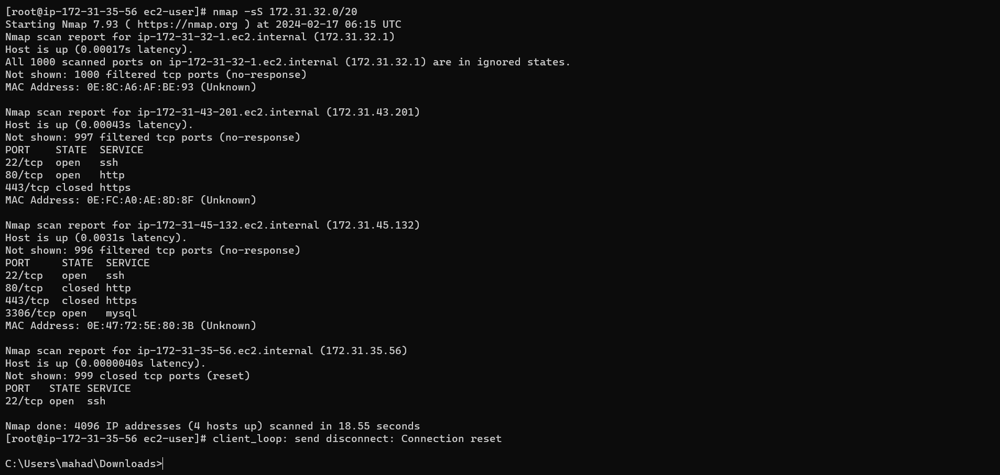

All these network activities are stored in VPC flow logs which GuardDuty takes as input for threat analysis. Now doing port scanning and pinging to malicious host from compromised instance that will give us Recon:EC2/Portscan and unauthorized EC2 access malicious IP caller finding on the GuardDuty console.
Now it takes a few minutes to display the finding on the GuardDuty console. Findings are automatically sent to CloudWatch Events and new findings are exported within 5 minutes.

After the required amount of time, the CloudWatch event rule will receive those finding logs and if the finding events are matched it will invoke target service. Here we have SNS Topic and Lambda function as out target service.
SNS Topic subscribers will receive an email notification containing finding details.

Now when Lambda gets triggered it will change the security group of the compromised instance. Compromised instances details are available in the event logs and the Lambda function is extracting the affected instance details from the event variable. The Security Group will isolate the compromised instance from the whole infrastructure.

In this way we can identify threats using GuardDuty on our AWS infrastructure and have an automated prevention mechanism using AWS Lambda functions.
